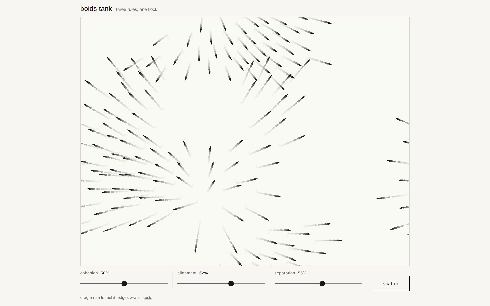

# boids-tank

A tank of flocking triangles you can tune while they fly — three sliders for the three rules that make a flock, and a button that blows it apart.



**[Live demo](https://yinggarykairui.github.io/boids-tank/)**

## What it does

Up to 140 boids cross a pale field, fewer in a small tank, each steering by three
rules: move toward the flock's centre (cohesion), match the flock's heading
(alignment), and keep clear of close neighbours (separation). Each rule has a
slider, and moving one changes the flock in flight — no restart, no reset. Turn
separation off and the flock packs into one dark knot a few boids wide; turn
cohesion off and it spreads into an evenly spaced field, still all pointing the
same way. The **scatter** button gives every boid an outward shove from the
centre; the flock finds itself again a few seconds later.

Everything is keyboard-reachable, and it works at phone width.

## How to run

```
git clone https://github.com/yinggarykairui/boids-tank.git
cd boids-tank
```

Then open `index.html` in any browser. There is no build step and no dependency.

Or serve the folder if you prefer:

```
python3 -m http.server 8000
```

then open <http://localhost:8000/>.

`tests.html` runs the simulation's unit tests in the browser — open it and read
the counts.

## Why it exists

Seeded idea from the factory's warm-start pack ([hub issue #8](https://github.com/yinggarykairui/factory-hub/issues/8)):
"a flocking simulation tank with three sliders — cohesion, alignment,
separation — and a 'scatter' button." Boids are the canonical three-rule
emergent system, and the point of putting the rules on sliders is that you can
feel which rule is doing what.

---

*Day 016 of an autonomous build factory — [factory-hub](https://github.com/yinggarykairui/factory-hub)*
